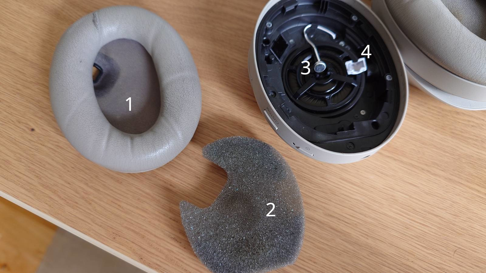
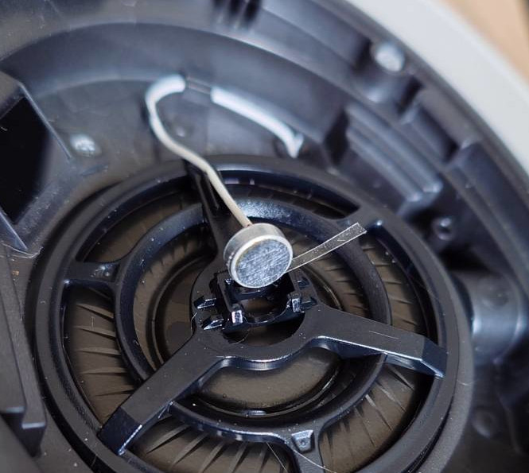

---
title: WH1000-XM4 Noise fix
date: 2025-06-21
slug: xm4noise
tags: solution
...

After three years of dedicated service, my Sony WH1000-XM4 headset started making odd noises in the left ear cup. It only occurred when the ANC was enabled, and seemed to be related to head movement or when the headset slips back and forth over the ear. The sound was a sort of clicking, clucking noise with some whistling components. The same earcup also had a very feint hissing sound, always present but only noticeable when nothing was playing.

# Solutions online

[Several](https://www.youtube.com/watch?v=aCD9grHot20) [other](https://www.reddit.com/r/SonyHeadphones/comments/n1bu7n/wh1000xm4_high_pitched_noise_in_left_ear_cup_when/) [people](https://www.reddit.com/r/SonyHeadphones/comments/15w7t5m/fix_wh1000xm4_high_pitched_noise/) [have](https://us.community.sony.com/s/question/0D54O00006affAqSAI/wh1000xm4-static-crackling-noise?language=en_US) reported noise issues with the XM4, but none of their descriptions match my problem and their suggested fixes did not seem to work for me.

I found online and tried the following methods to remediate the issue:

- Make sure there is no condensation inside the ear cup
- Ensure that the two wires of the internal ANC microphone are clearly separated from each other
- Ensure that the ear cup itself is properly attached and seals against the headset body

Another potential cause is that [the microphone itself is damaged](https://www.reddit.com/r/SonyHeadphones/comments/15w7t5m/fix_wh1000xm4_high_pitched_noise/) and needs to be replaced.

[This thread](https://www.ifixit.com/Answers/View/740970/ANC+mic+in+right+ear+gives+off+high-pitched+whining+that+is+deafening.) on iFixit suggests that the microphone's own mesh can be the cause of the issue, and that removing it may help. Other suggested solutions are to move the microphone to a different position inside the ear cup.

# My solution
For me, two changes combined made the problem go away: cleaning sweaty/dirty parts and making sure the microphone is firmly mounted. For some great instructions on disassembly of both sides of the headset, please take a look at [iFixit's guide](https://www.ifixit.com/Guide/Sony+WH-1000XM4+Ear+Pads+Replacement/143667).

## Cleaning the internal microphone
Clean the parts around the microphone which are exposed to ear gunk:

 1. Ear cup mesh
 2. The foam insert
 3. The mesh on the front of the internal microphone itself
 4. The rubber dome covering the microphone

I used cotton swabs and isopropyl alcohol, gently rubbing and then letting the parts air dry

This cleaning on its own was not enough to solve the problem, so this probably wasn't the issue.

## Mounting the microphone firmly

The internal microphone was noticably loose in its cradle, and could move a fraction of a mm when shaken/jostled. To prevent this, I cut a thin strip of tape and wrapped it around the edge of the microphone until it had a more snug fit in the plastic frame.

**Be very careful when handling the microphone**, as it is quite sensitive. Also make sure your tape doesn't reach in front of the microphone, as that can interfere with its operation.

In my case, 1.5 wraps of tape was enough to make it stop moving on its own.

After reassembling, the noise problem has been reduced. It still reoccurs on occasion, and appears to be related to movement of the headphones (typically synced with my footsteps).

Pressing gently on the microphone bump inside the ear cup can sometimes make the noise go away, but **I don't recommend** getting used to this as a solution. The motion sensitivity suggests again that this is related to a loose microphone.

## Cleaning the external microphone
By removing the four silver screws around the speaker driver (they are also marked by arrows in the black plastic!), you can take off the external ear cup cap. Be very careful when separating the cap, since both sides have cables extending from the cup body and into the cap itself!

There is another microphone mounted at the top of this cavity. This is the microphone with the oblong decorated mic grill on the outside of each ear cup. This microphone is also used for noise cancelling, as you can confirm by gently blowing into it while ANC is enabled.

I gently removed the rubber cover from the cup and cleaned the filtered face of the mic with a cotton tip and some alcohol.

Finally, I ensured that all the wires were inserted in their plastic holders. There is a black wire extending into the left ear cap (NFC, I believe), which has a little fastener inside the cup. I made sure all the wires were in their intended places and reassembled the ear cup.

**At this point the always-present hissing sound was gone**

Something about either the cleaning of the mic or re-seating the rubber cover in its place seems to have remedied that noise.

For a while none of the other noises reappeared, so maybe this is enough of a fix for your case.

## Update 2025-11-29: Replacing the microphone
Since completing the above repairs, the screeching noise reappeared once on each side. When the simpler fixes above didn't work, I resorted to replacing the internal microphone on the noisy side. The theory behind this is that sweat and gunk gets inside the microphone and causes enough interference for the ANC algorithm to freak out.

By suggestions online, I used the PUI Audio ROM-2235L-HD-R ([Mouser](https://mou.sr/4aiAC39), [DigiKey](https://www.digikey.com/short/n5w5jndq)). Installation was pretty easy, as long as you have either a clamp or a friend to hold the module in place while soldering.

Since replacing the first bad microphone I've had no problems on that side for five months. When the other side started making noise I replaced that as well and it has been working fine for about a month at this point.

If you're going to buy a replacement microphone, you may as well get four of them. As far as I can tell, the internal and external ANC microphones are all identical and the replacement part is cheap.

# Other observations
While testing this solution, I accidentally left tape sticking out in front of the microphone, and forgot to add the foam insert when reassembling the ear cup. This led to a **very loud** squealing noise which hadn't been there before. The same happens on the other (functioning) side if I take the foam insert out. It seems that if the ear forms a cup around the microphone, the result is this ear-piercing shriek.

Re-applying the tape more carefully and including the foam insert made the squealing go away.

This suggests to me that a malfunctioning microphone or interference with it (covered, dirty, misaligned) can be the cause of these problems as well.

It also suggests that a broken/damaged foam insert could be a part of the problem; even when the microphone works perfectly (as my right-side did), interfering with the foam insert or the rubber dome can still cause feedback in the ANC.

If the fix above doesn't work for you, I would suggest looking at other potential problems related to the two (internal and external) microphones on the affected side of the headphones.

 - Is the cable damaged?
 - Is the plastic mount damaged?
 - Is the microphone itself damaged?
 - Is the rubber dome damaged or missing?
 - Re-seat the microphone in its proper place and ensure it can't move
 - Make sure all cables are neatly held in place where the case has attachment points.

I also have a suspicion that you can resolve the feedback shriek by using a thicker ear pad. Aftermarket replacements such as [wickedcushions](https://wickedcushions.com/products/replacement-ear-pads-for-sony-wh1000xm4-black) may help pull the microphone away from your ear and prevent the noise.
