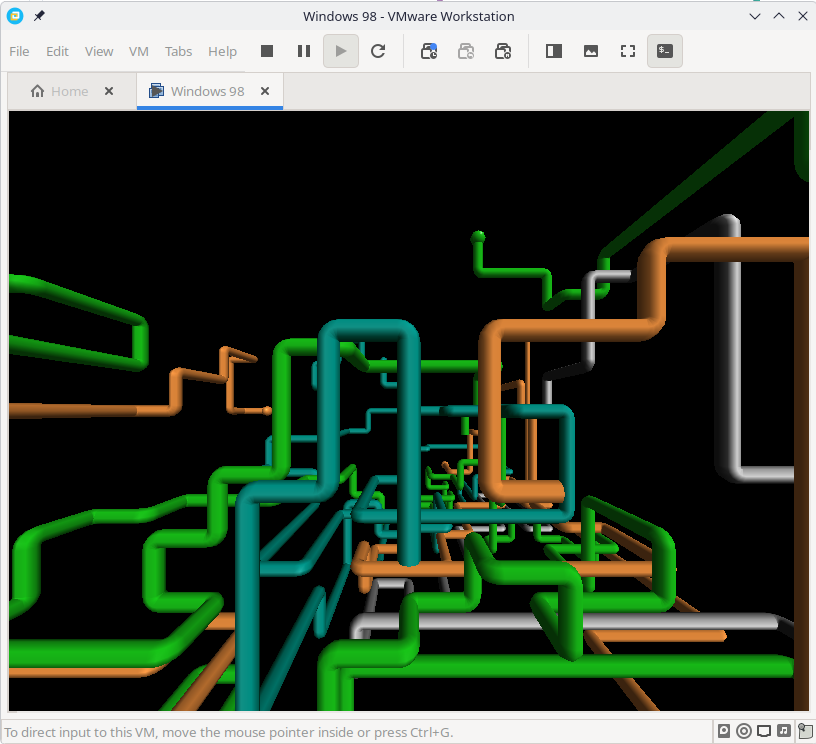
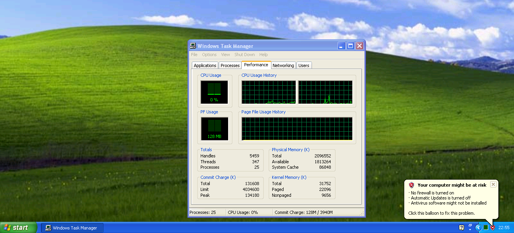
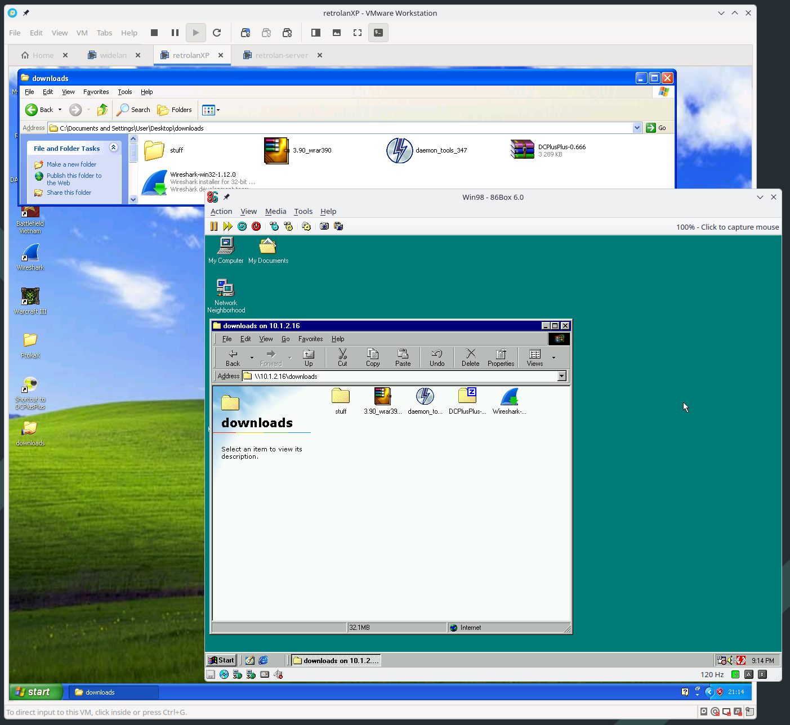

---
title: Retrolan 1: Virtual MMX
date: 2026-09-07
slug: retrolan1
tags: retrolan,gaming
...

One of the things you get for free while passing through your 30s is an
increasing sense of nostalgia. If you were also shaped by computering in the
Y2K era, chances are you have fond memories of floppy drive noises, LAN
parties, NoCD cracktros and not-quite-effortless file sharing.

Computers these days are *faster*. Orders of magnitude faster. Operating
systems are more convenient. Applications are more accesible. The web is
always-on and far more useful than it used to be. Although hardware costs
are through the roof at the moment, computing is more accessible now than it
was 30 years ago at least.

OK, great, but we *miss* something from back then, don't we? Well, let's build it!
This is a series of posts about how to recreate some of that 2003 LAN party
magic in the comfort of your 2026 hardware. We'll walk through creating a sick
gaming virtual machine, then move on to programs and games and stuff and
finally: Global LAN connectivity to your friends!

# Requirements

I'll assume you're just like me: Pining for the Windows 98-XP era of computer
gaming, but well familiar with modern Linux and stuff. You'll need an OK modern
machine, but this can probably be done on an i7 from 2015 if that's what you
happen to have available to you. Everything will be done with free (as in beer)
or abandoned software, and free (as in liberty) wherever possible. Sorry about
the compromise, we'll see how far we get.

# Selecting a Hypervisor

This is part 1: Virtual MMX. Our goal for today is to set up two virtual
machines: one running Windows 98 and one running Windows XP. They will have
both have working sound, graphics and network support.

The first thing we need is a hypervisor. This is the virtualization host
we'll use to run our bad-ass imaginary gaming rigs. Let's look at some contenders.

## Libvirt (KVM/QEMU)

Libvirt has several strengths compared to the other alternatives. It's free and
open-source, it's likely a first-rate member of your host distribution, and it
rests on robust support in the mainline Linux kernel.

What this means is, you can install and set up Libvirt and a nice graphical
front-end like virt-manager and it won't require installing any third-party
kernel modules and stuff that will pollute your otherwise neatly managed
system. Excellent.

For Windows 9x guests, Libvirt with QEMU supports the
[SoftGPU](https://github.com/JHRobotics/softgpu) drivers, which should give you
OK graphics performance.

[qemu-3dfx](https://github.com/kjliew/qemu-3dfx) is a set of patches and support drivers for QEMU which adds passthrough of GLIDE and OpenGL to the host for better 3D performance. I haven't been able to build it, but it seems like a good option. Be aware that there's some licensing drama in the project at the moment.

## 86Box
86Box is more of an emulator than a Hypervisor, really. It does a great job
emulating all kinds of early to middle-age 8086, 286, 386, 486, Pentium and
Pentium-2 machines. It's accurate all the way down to the BIOS, and it even
allows you to add *floppy drive sounds* which is absolutely charming.

It supports a wide range of period-accurate peripherals such as sound, graphics
and network cards.

Performance will suffer; my Ryzen 5950X has trouble running a 200MHz Pentium 2
at full speed. For that reason, 86Box is probably best reserved for older
target machines. If you want a good host for your Windows 95 installation,
86Box is a good bet. If you want to play games that rely on specific hardware
(say, Soundblaster Pro 2), that's also a point in favor of 86Box

Networking-wise, it supports both a nice transparent NAT (SLiRP) and connecting
your VM to a bridge device which is useful for our endeavors.

## VirtualBox

VirtualBox used to be the go-to for linux VMs, but it seems that our target
period has fallen out of support.

For Win9x, [SoftGPU](https://github.com/JHRobotics/softgpu) is reported to work
with VirtualBox, but the official driver packs have dropped support for Windows
XP and 2000. As far as I can tell, this means we can't get 3D acceleration on
XP.

[Rumor has it](https://docs.oracle.com/en/virtualization/virtualbox/6.0/user/guestadd-video.html)
hardware 3D acceleration should work with VirtualBox 6.x, but I haven't dared
to try it.

## VMware

VMware Workstation is free for personal use these days, which makes it feasible
for our purposes. Compatibility is pretty great, and most importantly: Windows
XP graphics drivers are still officially supported. I tried installing Windows
XPSP3 in VMware Workstation 26 and it just *works*.

Networking is a bit messier in VMware than in other solutions, but you can set
up a bridge for your retro VMs to network them together without connecting them
to the Internet.

Compared to something like libvirt, VMware is a bit less integrated into the
standard Linux experience. It installs some of its own kernel modules, but if
you're lucky there are packages for your distribution so you can neatly upgrade
or uninstall.

## Choices, choices

For the XP machine, VMware will be my choice of hypervisor entirely due to the
great driver support.

As for Windows 98, I'll try both VMWare (which appears to work well) and 86Box
(for the greater accuracy, perhaps).

# Installation

## Windows 98SE

In VMware, I'd recommend choosing hardware compatibility "VMware Workstation
5.x". One CPU, 256MB of RAM, 12GB of disk space, good to go.

In 86Box, you've got a lot more choices. I've settled on the following, which
seems to work well:

- Machine: [i440BX] ASUS P2B-LS
- CPU: Pentium II (Deschutes) / 166MHz
- Memory: 256MB
- Video: [AGP] 3dfx Voodoo3 1000
- Audio: [ISA16] Sound Blaster AWE32 PnP
- NIC: [ISA] Novell NE2000 (TAP)

It's important to set memory ranges and IRQ numbers for each device, such that
they do not collide with each other. The joys of old-timey computing.

For the OS, we'll use the excellent [Windows 98 Quick Install](https://github.com/oerg866/win98-quickinstall),
which is a custom CD and installer for Windows 98 SE and a large set of drivers
and fixes. Pop it into the VM's CD drive, add the boot floppy (if your BIOS
can't boot from CD), and follow the installer steps.

This is roughly 300x faster than the official Windows 98 installer. Absolutely
stunning work.

Once inside, open Control Panel / System / Device Manager and make sure all
your devices have drivers.

*We'll get to you.*

For VMware, start by installing "VMware tools" from the menu. This includes
video drivers and better mousing support. The sound card is an es1371 and needs
[Ensoniq drivers](https://archive.org/details/creativeensoniqaudiopciiso).

*3D support working as intended*

For 86Box, the devices above aren't Plug-n-Play, so you'll have to select the
device type manually when installing drivers. Win98QI includes a lot of drivers
for common devices such as Sound Blaster, Voodoo and NE2000.

## Windows XPSP3

This process is quite streamlined. Use the latest machine compatibility
settings, give the machine 4GB of RAM and a couple of processors, 120GB of disk
or so.

Install XPSP3 as you normally would, and activate it
[*somehow*](https://computernewb.com/wiki/QEMU/Guests/Windows_XP#Activation).
Install the VMware tools and presto!

*Sweet*

# Final words

OK, that's all it took to install some classic Windows OS versions on your
fancy modern Linux machine.

There are benefits to using a single Hypervisor solution for all of your
machines, but nothing prevents you from using linux Bridge devices to connect
different ones together...

Next time: Connecting your little machines into a virtual LAN

*Coexist! It's possible to bridge networks between different Hypervisors.*

