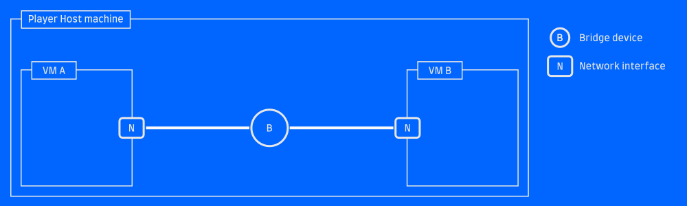
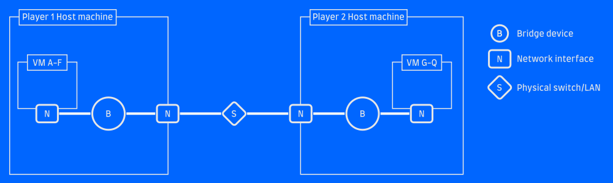
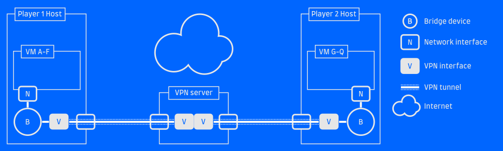
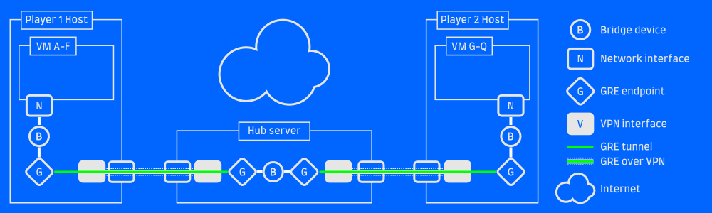

---
title: Retrolan 2: Virtual Network
date: 2026-09-12
slug: retrolan2
tags: retrolan,gaming
...

So you've got a cool retro gaming VM, and so do your friends. And you want to
connect them to each other. Let's look at some options for connecting them
together.


## Option 1: Local bridge
The simplest way to connect two or more VMs is to run them all on the same host and set up a bridged network for them.


*Bridged sibling VMs*

This is usually an option right in your virtualization solution, typically
called a "Private network", "Host-only network" or "Bridged network".

In 86Box, you do this by selecting `Mode: TAP` and giving your bridge a
descriptive name. All VMs with the same "TAP bridge name" configured will become
connected to the same virtual network.

In VMware, select (counter-intuitively) "Host-only network" or create a new
virtual network with that mode. Again, every VM set to the same network will be
connected.

### Why not?
The big shortcoming of this is pretty obvious: the VMs have to run on the same
host. Maybe your friends can remote in via SPICE or VNC or something, but
performance will suffer for it.


## Option 2: Physical LAN
If you've got your friends in the same room (LAN party! Woo!), you've got the
option to connect your VMs to a physical network via bridges. This can also be
useful if you want to connect your VMs with your friends who brought real
iron to the party.


*VMs bridged to a physical LAN*

If you're using 86Box or libvirt, this requires you to create a bridge
interface manually. Other interfaces can then be added to the bridge as
"ports", each acting as a port on a physical switch would.

If the host has an ethernet interface `eth1` which is connected to the physical
LAN, leave it unconfigured and do the following:

```
ip link add type bridge name retrolan
ip link set eth1 master retrolan
ip link set retrolan up
```

Now you've got a bridge device called `retrolan` and you can use that as the
bridge name in 86Box or libvirt to connect one or more VMs to it. The VMs will
see your physical network!

Some systems allow you to configure a "Bridged network" and hook
your VMs up to an existing interface, automatically creating the bridge for
you. I find that this doesn't always work reliably, and it's probably more
robust to create the bridge yourself and attach VMs to it.

Note that if your host needs to use the same LAN as well (for example, it's your
connection to the internet), that can be done by configuring the bridge interface
instead of `eth0`. Assign an IP address to it, start a DHCP client, whatever
you would normally do with your ethernet interface.


### Why not?
This will work great, as long as your friends are on the same physical LAN as you are. Over the internet, this won't work.


## Option 3: VPN
The obvious answer to the internet question is a VPN such as OpenVPN or
WireGuard. If you connect the host to a VPN and then bridge your VMs to the VPN
interface, they'll be able to communicate across the distances.


*A VPN server bridges the gap*

This requires a server on the internet for everyone to connect to. That can be
one of the player host machines, if you have a public IP and can forward the
VPN service port to the proper machine.

I won't cover the details of setting up a VPN here, but if you want something quick
and relatively simple I definitely recommend WireGuard and the `wg-quick` utility
to configure it.


### Why not?
If your VPN tunnel doesn't support Layer2 traffic, you'll find this solution
lacking. OpenVPN and friends typically work on Layer3 (the IP layer), but won't
forward packets which lack Layer 3. This is fine for the vast majority of traffic,
but if you're trying to play old games which make assumptions about the LAN, perform
funky broadcasts or maybe even use IPX instead of IP... it probably won't work.


## Option 4: GRE over VPN
But there's a solution! The GRE protocol allows you to tunnel Layer2 over IP,
which means you can set up a link between machines which looks like IP traffic
(will pass through your VPN without issue!) but actually carries Layer2
traffic.

GRE tunneling support is built into Linux, and requires no special software to set up.

If you've got a working VPN such that Host A at 10.0.0.1 can reach Host B at 10.0.0.2,
it's pretty straight-forward to set up a GRE tunnel between the two:

```
# On host A
ip link add my_gre_tunnel type gretap local 10.0.0.1 remote 10.0.0.2 ttl 255
ip link set my_gre_tunnel up

# On host B
ip link add my_gre_tunnel type gretap local 10.0.0.2 remote 10.0.0.1 ttl 255
ip link set my_gre_tunnel up
```

This will create a GRE tunnel interface named `my_gre_tunnel` on both hosts,
and any traffic you pass to that device will come out the other end. If you add
that GRE tunnel to your local VM bridge network on both ends, VMs on host A will
be able to communicate with VMs on bost B!

```
# Add the tunnel to the bridge we created before
ip link set my_gre_tunnel master retrolan
```


This is a point-to-point tunnel, which is fine if there are only two of you.
For multier players, one solution is to set up a central server (the VPN server
is the natural choice!), let everyone GRE tunnel to that server and then bridge
all the GRE interfaces. The server will act as a hub in a star topology network,
and is the only machine in the setup that needs a public IP address.



*A GRE tunnel over a VPN tunnel*

With this setup all gaming VMs of all players will see each other. Each player
can connect an arbitrary number of devices which will share the same VPN
connection and GRE tunnel. **Nothing** needs to be installed inside the VMs,
which means it will work on any guest machine/OS that has a network interface.


# Simplify
The solution above can be a bit daunting, and herding all your friends into successfully
connecting may be a bit of a challenge. I've created [WideLAN](https://gitlab.com/eldstal/widelan),
a set of helper scripts to make the setup both easier (just send a config file to your friend)
and less error-prone. If you don't want to set up bridges and stuff on the host machine, you can
even run the VPN client and GRE tunnels in a VM!

I've tried setting up a free-tier EC2 instance to serve as the Hub server, and the tunneling introduces
negligible latency. Be aware though, that you want a server placed where it has the minimum ping
to your host systems! Your in-game ping will be the sum of the latencies to the server.


